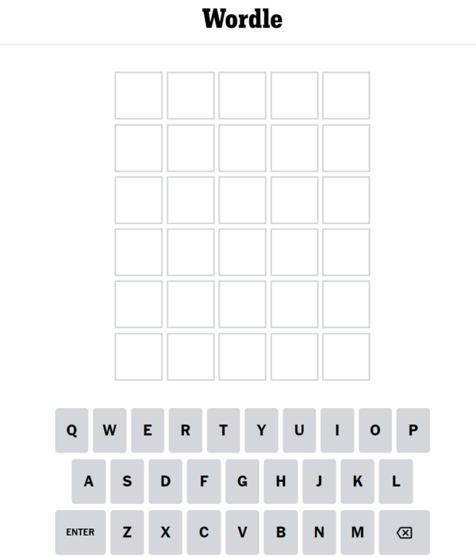
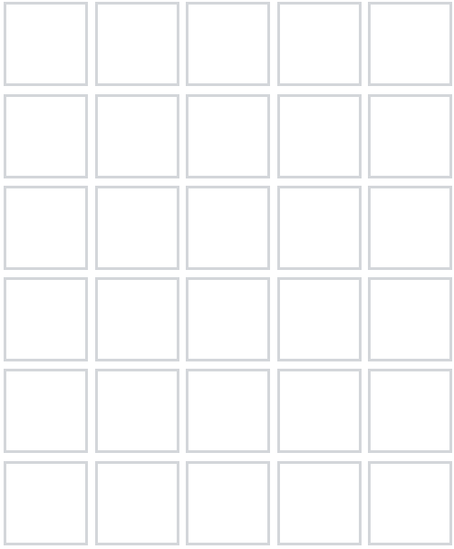
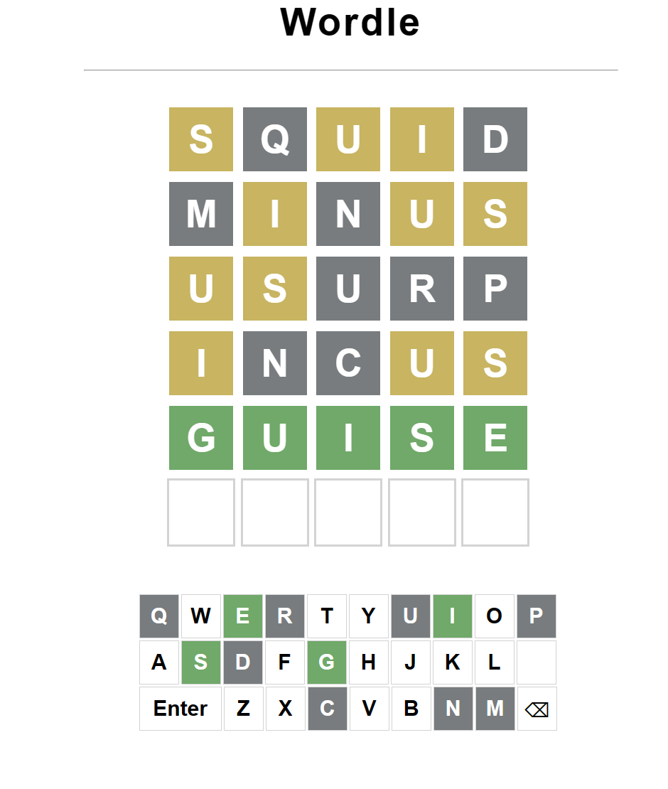
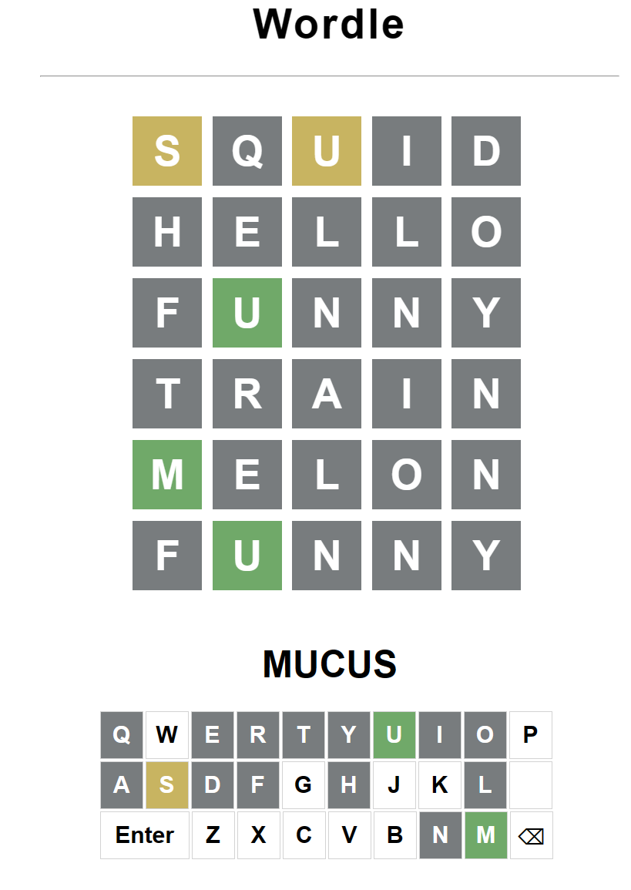
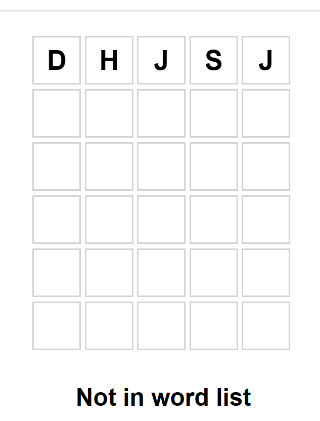

# Wordle Game preview

## Rules
1. **Objective:** Guess the secret word.
2. The secret word is a 5-letter word.
3. You have 6 attempts to guess the correct word.
4. After each guess, you will receive feedback:
   - A green square means a correct letter in the correct position.
   - A yellow square means a correct letter in the wrong position.
   - A gray square means an incorrect letter.
5. there's a list of word that you can use so can you cannot type in random stuff
## Fonts
| Font Name     | Provider          | Description                    |
| ------------- | ----------------- | ------------------------------ |
| Open Sans     | Google Fonts      | Friendly sans-serif            |
| Lato          | Google Fonts      | Modern sans-serif              |

## Components
 The game will be played on a 6x6 grid like this:

In the case of a good answer:

In the case of a good letter but in the wrong place:

if the letter is not in the word:

## Guesses example
- **Guess 1:** [ ] [ ] [ ] [ ] [ ]
- **Guess 2:** [X] [X] [X] [X] [X]
- **Guess 3:** [X] [Y] [X] [X] [X]
- **Guess 4:** [Z] [X] [Y] [Y] [X]
- **Guess 5:** [Z] [X] [Z] [Z] [X]
- **Guess 6:** [Z] [Z] [Z] [Z] [Z]

## Legend
- [ ]: Placeholder for a letter (empty square)
- [X]: Incorrect letter
- [Y]: Correct letter in the wrong position
- [Z]: Correct letter in the correct position

## Here's an actual example

If you win, all the square will be green. We can see that the yellow square we're right letters but at the wrong place. Grey squares we're letters not in the word.

## Example where you lose

# when you enter an invalid word

That's what happens when you enter an invalid word.

